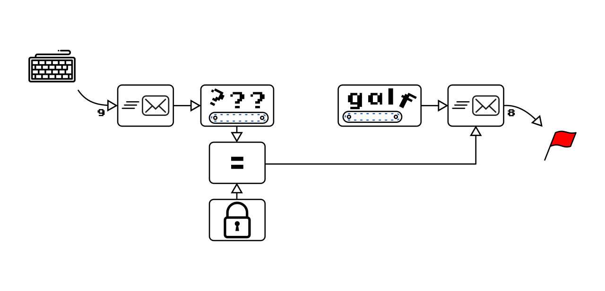
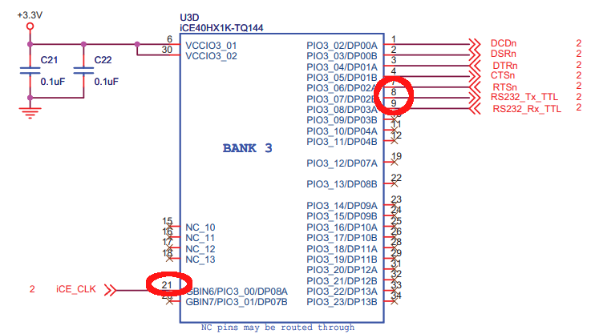
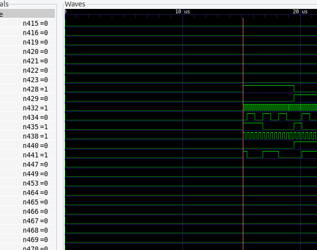
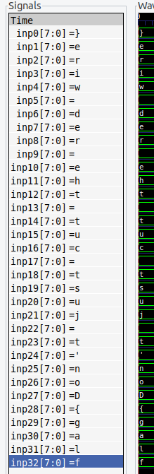

# button-less

## TL;DR

1. Read out firmware blob
2. Decompile to Verilog
3. Trace logic from input to output
4. Find the one point where a large tree of logic is clocked into a flip-flop
5. Hardcode the flip-flop value to 1
6. Rebuild FPGA bitstream
7. Load bitstream and read with baudrate 115200 from USB serial input.
8. ???
9. Profit!
10. ???
11. Solve button less extra (?) by using formal verification
12. ???
13. Profit x2!

## Tools used

- Magnificient Stallion Verilog Cleaner 
- icestorm
- yosys
- nextpnr
- iverilog
- gtkwave
- symbiyosys
- z3/boolector

## 0. Inspect information

We get an iCEstick FPGA development board and a simple high-level schematic:



## 1. Read firmware blob

The iCEstick is a development board for the ICE40 FPGA family that has been available for the ICE40 FPGA family for a long while. It has been a staple board for showing examples of open-source ICE40 based tool flows due to its ubiquity and low cost.
It comes with a FTDI 2232H controller for flashing the SPI EEPROM containing the FPGA bitstream and eventual other content, as well as performing UART I/O.

Since the FPGA bitstream is stored in an off-the-shelf EEPROM - and the FPGA doesn't support any bitstream encryption - it is possible to directly read back the bitstream from the EEPROM.

To do the extraction the **icestorm** tool `iceprog` can be used:
```sh
iceprog -r test.bin
```

This should read out a 256 kB file from the EEPROM to `test.bin`.

Now that we have this we can always flash this back into the EEPROM in case we need to restore the original behavior.

## 2. Decompile to Verilog

In the EEPROM contents the first *N* bytes will contain the bitstream. The size depends on the specific FPGA used. **Icestorm** though contains tools to convert this to/from more managable file-types. To turn the EEPROM blob into a workable format we run the command:

```
iceunpack test.bin test.asc
```

`test.asc` now contains an ASCII representation of the actual FPGA bitstream. This will consist of the primitives of the FPGA fabric, like routing, LUTs, IOs, FFs, block RAMs, etc.

To make it possible to understand and work with **icestorm** contains a tool to convert this formware to Verilog:

```sh
icebox_vlog test.asc > test.v
```

## 3. Trace logic from input to output

### 3.1 First things. Try and identify inputs and outputs

When looking at the Verilog input and output we can see the Verilog output tool has identified 2 inputs, and 4 outputs:

```verilog
module chip (input io_0_8_1, input io_0_11_1, output io_0_12_0, output io_0_13_0, output io_0_14_0, output io_0_14_1);
```

Looking at them from left to right it's clear that `io_0_8_1` is used as a clock for all the flip-flops. We will rename this `clk_12` as the iCEstick uses a 12 MHz crystal oscillator.

The only input left is `io_0_11_1`. We know from the challenge diagram that there's some input, and from hints we realize this refers to a pin number on the iCEstick FPGA. This fits with the pin used for the UART RX pin on the iCEstick FPGA. We will rename this to `stim`.

Looking at the 4 outputs we can search through the code to get an idea of what the different nets are used for. Tracing through we can see that `io_0_13_0`, `io_0_14_0` and `io_0_14_1` are all connected to the same net driven to zero. We can thus ignore all of those.

We are left with `io_0_13_0` which is driven by a bunch of internal logic. According to the schematic this is connected to pin 9 which is connected to the FTDI UART TX.



This is a strong indicator that we need send a key through the UART connection to unlock generating a flag output.

### 3.2 Check out if something is going on during steady state

Just to check out what's going on in the raw bitstream we write a super simple testbench:

```verilog
`timescale 1ns / 1ns

module tb;

    reg clk = 0;
    reg stim = 0;
    wire flag;

    always clk = #41.667 ~clk;

    chip DUT(
        .io_0_8_1(clk),
        .io_0_11_1(stim),
        .io_0_12_0(flag));

    initial begin
        $dumpfile("test2.vcd");
        $dumpvars();
        
        #10000 $finish(); // Just finish the simulation after 10 microseconds, fine-tune as needed when you are going in blind
    end

endmodule
```

This is just to get a glimpse of what's going on and what to look for further.

To execute it use:
```
iverilog tb.v test.v
./a.out
```

This will produce a VCD trace called `test2.vcd`.

To inspect it we will use the trusty `GTKWave`:
```
gtkwave test2.vcd
```

Inspecting the thousands of waveforms show that most are unchanging. But we notice some interesting changes. From 15.1 µs a lot of the initial behavior changes, and a bunch of signals spring to life.



My immediate thinking here is that this is an inbuilt reset generation circuit causing this. And sure enough, if you trace through the carry chain logic one of the short carry chains is used to generate an initial power-on reset for the rest of the FPGA circuitry. This shouldn't technically be a necessity but it could be a hardware detail requiring this.

Further, looking at the signals, especially `n1062` and `n1096` shows that some circuit is sampling with a rate of about 115200 samples per second and doing something for 2 periods every 10th cycle. This smells a lot like a UART signal generator which is idle. We will note this down for later investigations.

## 3.2 Apply tooling to simplify/rename/propagate simple wires

The problem at this point is that the design is quite massive - even for a very small FPGA like the ICE40HX1K. And that the combinatorial wires aren't helping a lot in navigating the design. With enough intuition and time you will find the interesting point but it will be very hard to pinpoint.

To fix this problem the *Magnificient Stallions* developed a simple tool to be used in a semi assisted decompilation of verilog to more high-level verilog.

To start with the tool expects a configuration file `cleanup_renames.json` as below:
```json
{
    "rename": {
        "io_0_8_1": "clk_12",
        "io_0_11_1": "stim",
        "io_0_12_0": "flag",
        "io_0_13_0": "unused0",
        "io_0_14_0": "unused1",
        "io_0_14_1": "unused2"
    },
    "output": [
    ],
    "resets": {
    },
    "trace_shifts": [
    ],
    "invert_ff": [
    ],
    "align_shifts": [
    ],
    "bundle_wires": {
    }
}
```

Running `cleanup3.py` reads a verilog file called `test.v` and produces 3 verilog output files according to 3 subsequent passes. `top_clean_pass2.v` will contain a version with renamed outputs and cleaned internals.

In this case we can see that the input `stim` only is registered once (n5). Renaming `n5` to `stim_d` and following this to `n6` (renamed to `stim_d2`) shows that the input winds up being used in a clocked process that is gated by `n1071`. Rename this in the `json`:
```json
        "n5": "stim_d",
        "n6": "stim_d2",
        "n1071": "shiftin",
```

Next we see that `n365` is used as a large part of *and* gates to flip-flops. Pretty much everywhere. Thise would indicate that this pin is used as an active low reset signal for our circuit. This is typically not very relevant for the normal operation of these electronics, but could be.
But isolating nominal behavior from reset behavior is important. For this case the tool tries to isolate lines needed for rest lines from active circuits.

To mark this as an active low reset we add:
```json
    resets: {
        "resetn": "0"
    }
```

Continuing from there the goal was to identify how the input data flowed though the input processing. This turned out to be a lot of copy-paste, searching and general hard work. No tooling available for this, yet.
In the end the renames had these marked up:
```json
        "n1071": "shiftin",
        "n1357": "latch",

        "n365": "resetn",

        "n452": "sh0_0",
        "n458": "sh0_1",
        "n456": "sh0_2",    
        "n460": "sh0_3",
        "n455": "sh0_4",
        "n454": "sh0_5",
        "n457": "sh0_6",
        "n459": "sh0_7",

        "n349": "latch_0",
        "n250": "latch_1",
        "n462": "latch_2",
        "n351": "latch_3",
        "n543": "latch_4",
        "n461": "latch_5",
        "n350": "latch_6",
        "n463": "latch_7",

        "n1770": "latch_comb",
        "n448": "latch_comb_d",
        "n936": "latch_comb_d2",

        "n5": "stim_d",
        "n6": "stim_d2",
```

From there it flowed through 33 layers of 8-bit shift registers (which took about 2 hours to map with this very slow tool):
```json
        "n338": "inp0_0",
        "n348": "inp0_4",
        "n337": "inp0_6",
        "n358": "inp0_2",
        "n251": "inp0_1",
        "n341": "inp0_3",
        "n361": "inp0_7",
        "n360": "inp0_5",

        "n344": "inp1_0",
        "n364": "inp1_7",
        "n363": "inp1_5",
        "n253": "inp1_2",
        "n342": "inp1_4",
        "n346": "inp1_6",
        "n252": "inp1_1",
        "n345": "inp1_3",

        "n332": "inp2_0",
        "n255": "inp2_1",
        "n254": "inp2_2",
        "n347": "inp2_4",
        "n362": "inp2_7",
        "n357": "inp2_5",
        "n247": "inp2_6",
        "n249": "inp2_3",

        "n334": "inp3_5",
        "n237": "inp3_3",
        "n248": "inp3_6",
        "n243": "inp3_1",
        "n335": "inp3_0",
        "n241": "inp3_2",
        "n339": "inp3_4",
        "n245": "inp3_7",

        "n236": "inp4_5",
        "n331": "inp4_0",
        "n244": "inp4_6",
        "n238": "inp4_1",
        "n330": "inp4_4",
        "n229": "inp4_2",
        "n321": "inp4_3",
        "n246": "inp4_7",

        "n240": "inp5_5",
        "n239": "inp5_7",
        "n328": "inp5_1",
        "n324": "inp5_0",
        "n318": "inp5_3",
        "n224": "inp5_6",
        "n325": "inp5_4",
        "n319": "inp5_2",

        "n228": "inp6_7",
        "n221": "inp6_4",
        "n223": "inp6_6",
        "n322": "inp6_2",
        "n316": "inp6_0",
        "n230": "inp6_5",
        "n320": "inp6_1",
        "n317": "inp6_3",

        "n106": "inp7_5",
        "n231": "inp7_2",
        "n212": "inp7_0",
        "n217": "inp7_3",
        "n219": "inp7_1",
        "n107": "inp7_7",
        "n216": "inp7_6",
        "n211": "inp7_4",

        "n25": "inp8_3",
        "n116": "inp8_1",
        "n209": "inp8_6",
        "n101": "inp8_7",
        "n218": "inp8_2",
        "n104": "inp8_5",
        "n95": "inp8_0",
        "n91": "inp8_4",

        "n103": "inp9_7",
        "n24": "inp9_1",
        "n97": "inp9_0",
        "n93": "inp9_6",
        "n96": "inp9_4",
        "n9": "inp9_3",
        "n100": "inp9_5",
        "n124": "inp9_2",

        "n12": "inp10_0",
        "n112": "inp10_7",
        "n7": "inp10_3",
        "n115": "inp10_2",
        "n99": "inp10_4",
        "n11": "inp10_6",
        "n98": "inp10_5",
        "n121": "inp10_1",

        "n122": "inp11_1",
        "n18": "inp11_3",
        "n120": "inp11_2",
        "n114": "inp11_5",
        "n14": "inp11_6",
        "n108": "inp11_7",
        "n109": "inp11_4",
        "n13": "inp11_0",

        "n22": "inp12_0",
        "n17": "inp12_7",
        "n111": "inp12_5",
        "n125": "inp12_1",
        "n42": "inp12_3",
        "n19": "inp12_6",
        "n113": "inp12_4",
        "n131": "inp12_2",

        "n130": "inp13_2",
        "n28": "inp13_0",
        "n27": "inp13_6",
        "n20": "inp13_4",
        "n45": "inp13_3",
        "n30": "inp13_7",
        "n123": "inp13_5",
        "n127": "inp13_1",

        "n117": "inp14_5",
        "n48": "inp14_3",
        "n29": "inp14_7",
        "n33": "inp14_6",
        "n129": "inp14_1",
        "n37": "inp14_0",
        "n31": "inp14_4",
        "n136": "inp14_2",

        "n142": "inp15_3",
        "n135": "inp15_2",
        "n139": "inp15_5",
        "n137": "inp15_1",
        "n36": "inp15_6",
        "n40": "inp15_0",
        "n35": "inp15_4",
        "n128": "inp15_7",

        "n44": "inp16_6",
        "n39": "inp16_4",
        "n134": "inp16_7",
        "n47": "inp16_5",
        "n43": "inp16_0",
        "n144": "inp16_1",
        "n148": "inp16_2",
        "n143": "inp16_3",

        "n155": "inp17_1",
        "n146": "inp17_7",
        "n141": "inp17_2",
        "n51": "inp17_4",
        "n50": "inp17_0",
        "n54": "inp17_3",
        "n46": "inp17_6",
        "n53": "inp17_5",

        "n152": "inp18_2",
        "n52": "inp18_6",
        "n61": "inp18_3",
        "n150": "inp18_1",
        "n49": "inp18_7",
        "n64": "inp18_0",
        "n63": "inp18_5",
        "n58": "inp18_4",

        "n66": "inp19_0",
        "n65": "inp19_5",
        "n162": "inp19_2",
        "n68": "inp19_4",
        "n59": "inp19_6",
        "n149": "inp19_3",
        "n158": "inp19_1",
        "n57": "inp19_7",

        "n151": "inp20_7",
        "n161": "inp20_2",
        "n160": "inp20_1",
        "n71": "inp20_0",
        "n67": "inp20_5",
        "n70": "inp20_4",
        "n167": "inp20_6",
        "n159": "inp20_3",

        "n286": "inp21_1",
        "n165": "inp21_0",
        "n157": "inp21_7",
        "n179": "inp21_6",
        "n168": "inp21_5",
        "n308": "inp21_2",
        "n163": "inp21_3",
        "n302": "inp21_4",

        "n196": "inp22_4",
        "n180": "inp22_0",
        "n294": "inp22_1",
        "n169": "inp22_3",
        "n309": "inp22_2",
        "n174": "inp22_6",
        "n288": "inp22_5",
        "n171": "inp22_7",

        "n188": "inp23_4",
        "n178": "inp23_3",
        "n173": "inp23_0",
        "n293": "inp23_5",
        "n296": "inp23_6",
        "n213": "inp23_1",
        "n172": "inp23_7",
        "n303": "inp23_2",

        "n185": "inp24_1",
        "n175": "inp24_3",
        "n314": "inp24_6",
        "n305": "inp24_2",
        "n312": "inp24_5",
        "n187": "inp24_4",
        "n182": "inp24_0",
        "n298": "inp24_7",

        "n181": "inp25_3",
        "n315": "inp25_5",
        "n411": "inp25_1",
        "n306": "inp25_2",
        "n184": "inp25_4",
        "n300": "inp25_0",
        "n214": "inp25_7",
        "n313": "inp25_6",

        "n403": "inp26_7",
        "n301": "inp26_3",
        "n282": "inp26_0",
        "n410": "inp26_1",
        "n409": "inp26_4",
        "n310": "inp26_6",
        "n399": "inp26_2",
        "n408": "inp26_5",

        "n401": "inp27_7",
        "n400": "inp27_4",
        "n396": "inp27_3",
        "n398": "inp27_2",
        "n407": "inp27_1",
        "n278": "inp27_0",
        "n389": "inp27_5",
        "n299": "inp27_6",

        "n397": "inp28_3",
        "n390": "inp28_7",
        "n383": "inp28_5",
        "n404": "inp28_1",
        "n297": "inp28_6",
        "n388": "inp28_4",
        "n393": "inp28_2",
        "n276": "inp28_0",

        "n270": "inp29_0",
        "n386": "inp29_6",
        "n373": "inp29_3",
        "n395": "inp29_1",
        "n392": "inp29_2",
        "n283": "inp29_7",
        "n385": "inp29_5",
        "n372": "inp29_4",

        "n267": "inp30_4",
        "n290": "inp30_7",
        "n284": "inp30_2",
        "n382": "inp30_5",
        "n269": "inp30_3",
        "n259": "inp30_0",
        "n374": "inp30_6",
        "n384": "inp30_1",

        "n375": "inp31_5",
        "n260": "inp31_0",
        "n265": "inp31_7",
        "n273": "inp31_4",
        "n266": "inp31_6",
        "n268": "inp31_3",
        "n287": "inp31_2",
        "n387": "inp31_1",

        "n378": "inp32_5",
        "n263": "inp32_4",
        "n272": "inp32_3",
        "n258": "inp32_0",
        "n262": "inp32_7",
        "n380": "inp32_2",
        "n277": "inp32_6",
        "n379": "inp32_1"
```
 
### 4. Find the one point where a large tree of logic is clocked into a flip-flop

When at this point many of the combinatorial nets left in the design are pretty much only for comparing the 33 bytes of serial input bytes with a constant value. A few are left for comparing values against the counters for the reset generator and UART baud rate divider and some extra stuff.

Seeing for example `assign n1808 = (!inp8_7)&(!inp8_4)&(!inp8_5)&(!inp8_0);` which is a 4 input `LUT` calculating a 66th of the final expression is an indicator of what's missing. Knowing the structure of the comparison tree we can tell that the 8th byte has to have bit 0, 4, 5 and 7 cleared for the key comparison to hold.

Following this tree of comparisons further down the combinatorial tree leads to `n1692`, then `n1802`, then `n988`, then finally `n1297` which is assigned to the flip-flop `n449`.

## 5. Hardcode the flip-flop value to 1 
The wire of `n1297` seems to be the magical connection. Replacing this a constant `1'b1` seems to allow us to override the input check with an always correct input in `top_clean_pass3.v`:
```
assign n1297 = 1'b1;
```

## 6. Rebuild FPGA bitstream
`rebuilt.pcf`:
```
set_io clk_12 21
set_io stim 9
set_io flag 8
```

Build:
```sh
yosys -p "synth_ice40; write_json rebuilt.json" top_clean_pass3.v
nextpnr-ice40 --asc rebuilt.asc --json rebuilt.json --hx1k --pcf rebuilt.pcf
icepack rebuilt.asc rebuilt.bin

# Flashing to icestick
iceprog rebuilt.bin
```

## 7. Load bitstream and read with baudrate 115200 from USB serial input.
```
tio -b115200 /dev/ttyUSB0`
...
flag{Are you ready to enter the rabbit hole?}
flag{Are you ready to enter the rabbit hole?}
flag{Are you ready to enter the rabbit hole?}
```

## 8. Bonus, reproduce flag from testbench

`tb.v`:

```verilog
`timescale 1ns / 1ps

module tb;

    reg clk = 0;
    reg stim = 0;
    wire flag;

    always clk = #41.666667 ~clk;

    reg [10*3-1:0] shift_regs = 0;
    wire [9:0] shreg;
    reg [7:0] data;

    reg [0:8*45-1] str = 0;
    reg [7:0] idx = 0;

    genvar gi;

    generate
        for (gi=0; gi<10; gi=gi+1)
            assign shreg[gi] = shift_regs[gi*3+1];
    endgenerate

    integer i;

    always
    begin
        // Simplistic UART receive function using 3x oversampling
        #(1e9 / 115200 / 3);

        shift_regs    = shift_regs << 1;
        shift_regs[0] = !flag;

        // Match start and stop bits
        if ({shreg[9], shreg[0]} == 2'b10)
        begin
            for (i=0; i<8; i=i+1)
                data[7-i] = !shreg[1+i];

            if (data == 10)
            begin
                $display("%s", str);
                str = 0;
                idx = 0;
            end
            else
            begin
                str[8*idx+:8] = data;
                idx = idx + 1;
            end

            shift_regs = 0;
        end
    end

    top DUT(
        .clk_12(clk),
        .stim(stim),
        .flag(flag));

    initial begin
        $dumpfile("test2.vcd");
        $dumpvars(1);
        
        #5000000 $finish();
    end

endmodule
```

```
iverilog tb.v top_clean_pass3.v
./a.out
```

## 11. Solve button less extra

It turns out there's an extra challenge hidden in the same firmware. The key to unlock the output of the FPGA is a flag in itself.

At this point we have identified the entire chain of the input character shift register, and we have identified the point where the comparison ends up. Either we could manually untangle the comparison to figure out what the input condition should be, or we could use formal verification to let a solver determine the input conditions where the comparison holds.

We are lazy and in a hurry so we go for the formal verification approach :) 

### 11.1 Prepare design for solving

To make it easy to read out the conditions where the check is true we bundle the input bits into multiple 8-bit wide nets. Most of the tooling only works with 1-bit nets.

Modifying the json to add the following will create new nets combining each byte.
```json
    "bundle_wires": {
        "inp0": ["inp0_0","inp0_1","inp0_2","inp0_3","inp0_4","inp0_5","inp0_6","inp0_7"],
        "inp1": ["inp1_0","inp1_1","inp1_2","inp1_3","inp1_4","inp1_5","inp1_6","inp1_7"],
        "inp2": ["inp2_0","inp2_1","inp2_2","inp2_3","inp2_4","inp2_5","inp2_6","inp2_7"],
        "inp3": ["inp3_0","inp3_1","inp3_2","inp3_3","inp3_4","inp3_5","inp3_6","inp3_7"],
        "inp4": ["inp4_0","inp4_1","inp4_2","inp4_3","inp4_4","inp4_5","inp4_6","inp4_7"],
        "inp5": ["inp5_0","inp5_1","inp5_2","inp5_3","inp5_4","inp5_5","inp5_6","inp5_7"],
        "inp6": ["inp6_0","inp6_1","inp6_2","inp6_3","inp6_4","inp6_5","inp6_6","inp6_7"],
        "inp7": ["inp7_0","inp7_1","inp7_2","inp7_3","inp7_4","inp7_5","inp7_6","inp7_7"],
        "inp8": ["inp8_0","inp8_1","inp8_2","inp8_3","inp8_4","inp8_5","inp8_6","inp8_7"],
        "inp9": ["inp9_0","inp9_1","inp9_2","inp9_3","inp9_4","inp9_5","inp9_6","inp9_7"],
        "inp10": ["inp10_0","inp10_1","inp10_2","inp10_3","inp10_4","inp10_5","inp10_6","inp10_7"],
        "inp11": ["inp11_0","inp11_1","inp11_2","inp11_3","inp11_4","inp11_5","inp11_6","inp11_7"],
        "inp12": ["inp12_0","inp12_1","inp12_2","inp12_3","inp12_4","inp12_5","inp12_6","inp12_7"],
        "inp13": ["inp13_0","inp13_1","inp13_2","inp13_3","inp13_4","inp13_5","inp13_6","inp13_7"],
        "inp14": ["inp14_0","inp14_1","inp14_2","inp14_3","inp14_4","inp14_5","inp14_6","inp14_7"],
        "inp15": ["inp15_0","inp15_1","inp15_2","inp15_3","inp15_4","inp15_5","inp15_6","inp15_7"],
        "inp16": ["inp16_0","inp16_1","inp16_2","inp16_3","inp16_4","inp16_5","inp16_6","inp16_7"],
        "inp17": ["inp17_0","inp17_1","inp17_2","inp17_3","inp17_4","inp17_5","inp17_6","inp17_7"],
        "inp18": ["inp18_0","inp18_1","inp18_2","inp18_3","inp18_4","inp18_5","inp18_6","inp18_7"],
        "inp19": ["inp19_0","inp19_1","inp19_2","inp19_3","inp19_4","inp19_5","inp19_6","inp19_7"],
        "inp20": ["inp20_0","inp20_1","inp20_2","inp20_3","inp20_4","inp20_5","inp20_6","inp20_7"],
        "inp21": ["inp21_0","inp21_1","inp21_2","inp21_3","inp21_4","inp21_5","inp21_6","inp21_7"],
        "inp22": ["inp22_0","inp22_1","inp22_2","inp22_3","inp22_4","inp22_5","inp22_6","inp22_7"],
        "inp23": ["inp23_0","inp23_1","inp23_2","inp23_3","inp23_4","inp23_5","inp23_6","inp23_7"],
        "inp24": ["inp24_0","inp24_1","inp24_2","inp24_3","inp24_4","inp24_5","inp24_6","inp24_7"],
        "inp25": ["inp25_0","inp25_1","inp25_2","inp25_3","inp25_4","inp25_5","inp25_6","inp25_7"],
        "inp26": ["inp26_0","inp26_1","inp26_2","inp26_3","inp26_4","inp26_5","inp26_6","inp26_7"],
        "inp27": ["inp27_0","inp27_1","inp27_2","inp27_3","inp27_4","inp27_5","inp27_6","inp27_7"],
        "inp28": ["inp28_0","inp28_1","inp28_2","inp28_3","inp28_4","inp28_5","inp28_6","inp28_7"],
        "inp29": ["inp29_0","inp29_1","inp29_2","inp29_3","inp29_4","inp29_5","inp29_6","inp29_7"],
        "inp30": ["inp30_0","inp30_1","inp30_2","inp30_3","inp30_4","inp30_5","inp30_6","inp30_7"],
        "inp31": ["inp31_0","inp31_1","inp31_2","inp31_3","inp31_4","inp31_5","inp31_6","inp31_7"],
        "inp32": ["inp32_0","inp32_1","inp32_2","inp32_3","inp32_4","inp32_5","inp32_6","inp32_7"]
    }
```

Run the flow to generate a new set of files.

### 11.2 Trim design down to only consider the key comparison

This step might be a bit confusing but we are only interested in the comparison of the input flip-flops.

If we were to remove all assignments and initializations of the `inp32_1` flip-flop it will contain `1'bX` (undefined) which will count as either value that might make sense to the comparison that it is used in whenever it's used. This is useful since we just want to know what value it should have for the condition we are interested in.

In the case of `inp13_1` we need to remove the assignment `inp13_1 <= inp12_1;`, `inp13_1 <= 0;` and change the initialization from `reg inp13_1 = 0;` to `reg inp13_1;`.

Doing this for all the `inp*` registers allows them to take on any value.

### 11.3 Add constraints for bounded model check

We use a `BMC` (bounded model check) style proof because it's easy to understand and formulate. A simplified explanation is that you give the solver `x` amounts of clock cycles or "simulator" steps to try and trigger any assertion in a proof testbench.

As we have just removed all constraints from how the input byte shift register is loaded this means the solver is free to initialize each byte right off the bat with something that should trigger our comparison.

To add the constraint that the solver should look for you can change the file as such:

```verilog
assign n1297 = n1782 ? (n988 ? (n449|n1240) : n449) : n449;
always @(posedge clk_12)
begin
    // Tell the solver that n1297 must NOT become true, ie. the input comparison should never become true.
    // If the solver can find a way to make it become true it will create a counter-example where we will be able to read out the flag.
    assert(!n1297);
end
```

### 11.4 Run solver

Create `proof.sby`:

```ini
[options]
mode bmc
depth 1

[engines]
smtbmc z3

[script]
read -formal top_clean_pass3.v
prep -top top

[files]
top_clean_pass3.v
```

Running this with `sby -f proof.sby` will give a ton of warnings about undriven wires, which is exactly what we are abusing. Then it will produce something like the following:
```
SBY 19:52:30 [proof] engine_0: ##   0:00:00  Solver: z3
SBY 19:52:30 [proof] engine_0: ##   0:00:00  Checking assumptions in step 0..
SBY 19:52:30 [proof] engine_0: ##   0:00:00  Checking assertions in step 0..
SBY 19:52:30 [proof] engine_0: ##   0:00:00  Checking assumptions in step 1..
SBY 19:52:30 [proof] engine_0: ##   0:00:00  Checking assertions in step 1..
SBY 19:52:30 [proof] engine_0: ##   0:00:00  BMC failed!
SBY 19:52:30 [proof] engine_0: ##   0:00:00  Assert failed in top: top_clean_pass4.v:1035.6-1038.19 ($assert$top_clean_pass4.v:1035$1467)
SBY 19:52:30 [proof] engine_0: ##   0:00:00  Writing trace to VCD file: engine_0/trace.vcd
SBY 19:52:30 [proof] engine_0: ##   0:00:00  Writing trace to Verilog testbench: engine_0/trace_tb.v
SBY 19:52:30 [proof] engine_0: ##   0:00:00  Writing trace to constraints file: engine_0/trace.smtc
SBY 19:52:30 [proof] engine_0: ##   0:00:00  Writing trace to Yosys witness file: engine_0/trace.yw
SBY 19:52:30 [proof] engine_0: ##   0:00:00  Status: failed
```

You can then open the trace proceduced with
```sh
gtkwave proof/engine_0/trace.vcd
```


